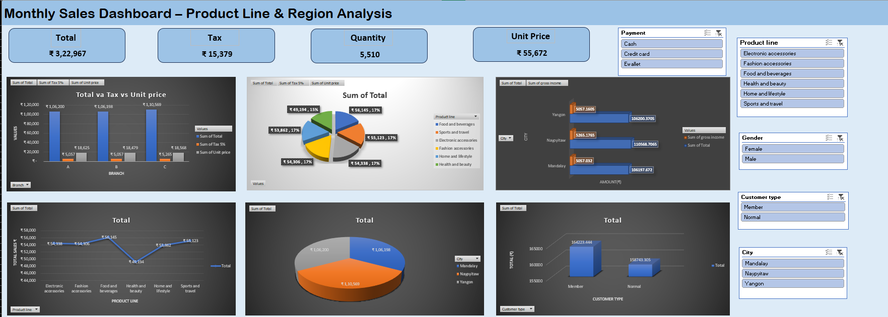

# 📊 Excel Sales Dashboard – Mini Project

This project is an **interactive sales dashboard** created using **Microsoft Excel**. It visualizes and analyzes key business metrics such as total sales, quantity, gross income, and customer types using pivot tables, slicers, and dynamic charts.

---

## 🔍 Features

- ✅ Product line-wise, city-wise, and customer-wise sales analysis
- ✅ Pivot Tables & Pivot Charts for summarizing data
- ✅ Slicers for dynamic filtering (by Product Line, City, Payment Type, Gender, and Customer Type)
- ✅ Dashboard summary box with key business insights
- ✅ Clean layout and professional formatting

---

## 🛠 Tools Used

- Microsoft Excel
  - Pivot Tables
  - Pivot Charts
  - Slicers
  - Line, Pie, and Bar Graphs
  - Data Labeling & Axis Titles

---

## 📁 File

- `Sales_Dashboard.xlsx` – Main dashboard file

---

## 📸 Screenshot
```markdown

